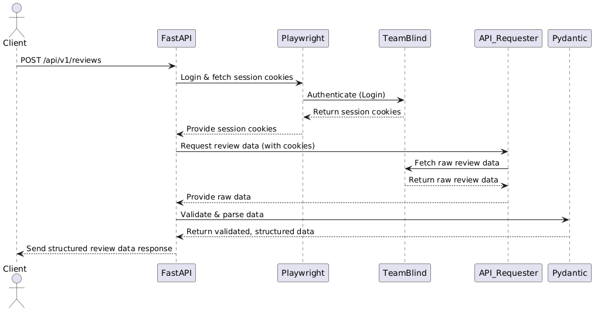

# TeamBlind Data Scraper
## Overview

**TeamBlind Data Scraper** is a robust, FastAPI-based web service designed to scrape and serve company review data from the TeamBlind platform. The application automates login procedures, extracts detailed review data, provides aggregate statistics, and exposes this information via a user-friendly RESTful API, ideal for data analysis and automated research tasks.

---

## Features

* **Authenticated Scraping**: Utilizes browser automation (via Playwright) to securely authenticate and manage session cookies for uninterrupted data retrieval.

* **Detailed Data Extraction**: Accurately parses embedded JSON payloads to obtain comprehensive review information such as ratings, summaries, pros and cons, and creation dates.


* **Pagination Support**: Efficiently handles multiple pages of review data through configurable parameters, allowing flexible data extraction based on specific needs.


* **Environment-based Configuration**: Conveniently configured via `.env` files to securely manage sensitive settings without code alterations.

---

## Technical Stack

| Technology / Library | Description                                     |
| -------------------- | ----------------------------------------------- |
| **FastAPI**          | Web framework powering the RESTful API.         |
| **Playwright**       | Headless browser automation for authentication. |
| **curl-cffi**        | Efficient HTTP request handling post-login.     |
| **Pydantic**         | Schema validation for robust API models.        |
| **Docker**           | Containerization for streamlined deployment.    |
| **Docker Compose**   | Simplified multi-container orchestration.       |
| **Python (3.11+)**   | Core programming language and runtime.          |

---

## System Architecture



---

## Project File Structure

```
├── app/
│   ├── api/
│   │   └── v1/
│   │       └── reviews.py            # Review API endpoints
│   ├── core/
│   │   └── config.py                 # Application settings and logger setup
│   ├── schema/
│   │   ├── chatinput.py              # API request schemas
│   │   └── review_model.py           # Data schemas for reviews
│   ├── utils/
│   │   └── playwright_utils.py       # Playwright automation utilities
│   ├── main.py                       # Application entry point
│   ├── requirements.txt              # Project dependencies
│   ├── Dockerfile                    # Container image definition
│   ├── docker-compose.yaml           # Container orchestration configuration
│   ├── .env.example                  # Template for environment variables
│   └── README.md                     # Project documentation
```

---

## API Documentation

The main API entrypoint is located at `main.py`. All endpoints reside under the `/api/v1/` namespace.

* **Swagger UI (Interactive)**: `/docs`
* **ReDoc (Alternative UI)**: `/redoc`

### Endpoint: Scrape Company Reviews

* **Request:** `POST /api/v1/reviews`

#### Request Body Example

```json
{
  "company_code": "Microsoft",
  "max_page": 2
}
```

| Parameter      | Type    | Description                                     |
| -------------- | ------- | ----------------------------------------------- |
| `company_code` | string  | TeamBlind company identifier (e.g., Microsoft). |
| `max_page`     | integer | Number of pages to scrape (minimum value: 1).   |

#### Response Example

```json
{
  "overall_review": {
    "companyName": "Microsoft",
    "companyUrlAlias": "Microsoft",
    "count": 11174,
    "career": "3.5",
    "balance": "4.2",
    "compensation": "3.2",
    "culture": "3.9",
    "management": "3.5",
    "rating": "3.9"
  },
  "reviews": [
    {
      "overall": 3,
      "career": 3,
      "balance": 4,
      "compensation": 3,
      "culture": 4,
      "management": 3,
      "summary": "Great work life balance",
      "pros": "Great work life balance compared to other organizations in the same sector",
      "cons": "Compensation isn't as great compared to companies of other size",
      "reasonResign": null,
      "createdAt": "2025-04-29T04:48:06.000Z"
    }
  ]
}
```

**Response Details:**

* **overall\_review:** Aggregate review statistics for the specified company, including overall and categorical ratings.
* **reviews:** Detailed individual reviews providing ratings, summaries, advantages, disadvantages, resignation reasons (if any), and timestamps.

The review parameters are configurable from `app.schema.review_model.py`.

---

## Environment Variables

Define application-specific settings securely within a `.env` file at the project's root directory. Example:

```env
PORT=8000
TEAMBLIND_USER_EMAIL=your.email@example.com
TEAMBLIND_USER_PASS=yourpassword
```

| Variable               | Description                         |
| ---------------------- | ----------------------------------- |
| `PORT`                 | Port on which the API service runs. |
| `TEAMBLIND_USER_EMAIL` | TeamBlind account email address.    |
| `TEAMBLIND_USER_PASS`  | Corresponding TeamBlind password.   |

---

## Running the Application

### Docker Compose (Recommended)

1. **Prerequisites:** Install Docker.
2. Create `.env` from the provided example.
3. Run:

   ```bash
   docker compose up --build
   ```

   > **Note:** Currently, credentials cannot be fetched in headless mode within Docker containers.

   Service available at: `http://localhost:<PORT>`

### Local Python Setup (Development)

1. **Prerequisites:** Python (version 3.11+).
2. Install dependencies:

   ```bash
   pip install -r requirements.txt
   playwright install
   ```
3. Configure `.env` as described above.
4. Launch application:

   ```bash
   uvicorn main:app --reload
   ```

   > **Note:** Locally, the application can fetch data successfully in headless mode.

   Service available at: `http://localhost:8000`

---

## Contribution

Contributions, feature requests, and feedback are warmly welcomed! Please submit pull requests or issues via the project repository.

---